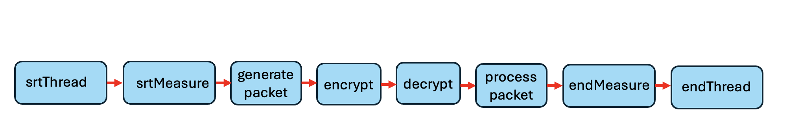

### Patterned Computation Evaluation Simulator 

The Patterned Computation Evaluation System (**pces**) is a simulation/emulation tool whose modeling constructs are optimized to express so-called 'patterned' computations.   These are computations that can be expressed as a sequence of function calls with known input/output patterns that are largely known in advance, with the transfer of control from one function to another being expressed as a data-bearing message being passed between them.  It is natural then to represent a patterned computation as a graph, with nodes representing functions and directed edges representing that the output of one function serves as the input to another.   Details are given in [PCES-Internals.pdf](#https://github.com/ITI/pces/blob/main/docs/PCES-Internals.pdf) .

##### Default Execution Model

The **pces** model assumes that a function executes whenever a message is received from another function.  It may also model that there is a non-zero elapse of simulation time between when the function execution starts, and when it completes, making its output message available.   The default response to message receipt is that **pces** look up this virtual time delay, depending on the specifics of the function, the specifics of the computational device it is modeled to be executing on, and the length (in bytes) of the message that triggered the function's evaluation.   The default function which receives the output of the simulated evaluation is identified by the successor function in the graph of the computational pattern.

In the default behavior, the **pces** model behavior does not depend on specific contents of messages, nor does the **pces** code implementing a response modify any data that might be associated with the message.   The intent of the default behavior is purely to simulate performance associated with executing the patterned computation, e.g., the latency and/or throughput of the computation.

*Figure 1: Chain of **pces** functions*

Figure 1 illustrates an example computational pattern, informally identifying the operations represented by the functions.   Of these, 'srtThread', 'srtMeasure', 'endMeasure', and 'endThread' are represent **pces** management operations, and not actual computations.    The first two initiate the execution of the pattern and measure the starting time.    The last two (respectively) measure the time when the prior sequence of function calls have terminated, and then ends management of this one execution of the pattern.

The computation pattern itself is represented by the interior four functions, which describe a sequence where a data packet is generated (e.g., perhaps by a sensor measurement), and is then encrypted.   The resulting encrypted packet is passed to a function that decrypts it, and then a final computation processes the result.   

Non-zero function time executations are usually associated with the generation, crypto operations, and processing of a packet, but no simulation time advance is associated with the management functions. Typically one imagines that that the output of the 'encrypt' function is communicated across a network to a different processor that executes the 'decrypt' function.   That may be true, but is not represented in the description of the computational pattern.  Part of a complete **pces** model is a specification of the distributed system on which instances of the computational pattern execute, and specification of the computational endpoints to which the functions are mapped.

 A **pces** function may have multiple incoming edges, and may have multiple outgoing edges.   A function execution is triggered by receipt of a message on any of its incoming messages.   When there are multiple output edges the function may select one, or multiple ones to receive its output.   Using default behaviors that choice is driven by  meta-data associated with the message at the time of its creation, e.g., the terminal node in the computation pattern to which the message is being directed.

Every instance of a **pces** function is associated with a 'class'.  This is not a full-fledged class such as one has in programming languages like python or C++, but rather a means of identifying the configuration information needed for a function, and the different responses that a function can have, depending on the 'type' of a message that triggers the response.  

A deeper explanation of **pces** messages and function behavior is given in [PCES-Internals.pdf](#https://github.com/ITI/pces/blob/main/docs/PCES-Internals.pdf) .

##### Developing PCES Models

A **pces** model is described by a collection of input files, each focused on some particular attribute of the model.   The files are in yaml format, and are expected to adhere to the [**pces** API](#https://github.com/ITI/pces/tree/main/docs/PCES-API.pdf).   A model requires a surprising number of details, and assuring the internal consistency of model expression within and between input files is a critical consideration, for model descriptions that contain inconsistencies or incoherence lead to simulation execution runs that crash mysteriously, or worse yet, report faulty measurements.

To aid the modeler in crafting **pces** models we have developed a tool [xlsxPCES](#https://github.com/ITI/pcesbld) that takes a model description embedded in an excel spreadsheet, and using python scripts transforms that information into properly formatted input files.   These scripts also check for the needed internal consistency in model expression.

Details on running a **pces** model are contained in [RunningPCES.pdf](#https://github.com/ITI/pcesapps/blob/main/docs/RunningPCES.pdf) .

##### Modeling a Network

**pces** does not contain any direct representation of network based communication.  A message that traverses a computation pattern follows the edges between functions.   Depending on how a computation pattern is mapped to a distributed network, an edge may traverse a network, or stay resident on the same host as the function that emitted it.

While the **pces** distribution compiles assuming the use of the [**mrnes**](#https://github.com/iti/mrnes) network simulation library, the interaction **pces** infrastructure has with a networking layer is encapsulated in a relatively sparse API. That said, the existing **pces** documentation implicitly assumes that **mrnes** simulates the networking.

##### Extended Execution Behavior Models

Using only default models of function behavior it is possible to assemble and execute **pces** models that draw solely from built-in libraries; it is not necessary for a modeler to write any bespoke code. However, **pces** is designed to easily allow modelers to developer their own libraries, or to craft specialized components for individual models.   An explanation of details requires more explanation of internals than is appropriate for this introduction, but the interested reader can consult [User Extensions to **pces**](#https://github.com/ITI/pcesapps/blob/main/docs/User-Extensions.pdf) .  For our purposes here, we will say that a user can either define a new function class and include instantiations of it, and/or extend a function class's behavior by writing new methods to respond to new message types.

##### Execution Control

A **pces** simulation is a program in the Go language.   There are a number of complete examples given in the [github.com/iti/pcesapps](#https://github.com/iti/pcesapps) repository.   Each has a 'main' program (main.go) comprised of just a few lines,  that call **pces** library functions to load and initialized a simulation model from input files (or execute code that generates those files).  The initialization typically involves creation of initial discrete events to be executed when the simulation is started.   Another statement in main.go calls a method that starts the execution of the simulation, passing as an argument a termination time.   The simulation runs until either the event with least time-stamp has a time that exceeds the termination time, or when there are no events left to execute in the event queue.   To wrap up then, main.go typically calls a method that has been written for the application which gathers the measurements made in the course of the simulation, summarizes them, and writes these summaries out to file.  The model has the option of letting **pces** present the output in one of three formats.  The first is a list of raw measurements, the second is a list of measurement types (defined by initialization parameters), with the mean and standard deviation of measurements of that type, and the third is a sample mean and confidence interval around that mean.

#### The PCES/MRNES System

The Patterned Computation Evaluation System (PCES) and Multi-resolution Network Emulator and Simulator (MRNES) are software frameworks one may use to model computations running on distributed system with the focus on estimating its performance and use of system resources.

The PCES/MRNES System is written in the Go language.  We have written a number of GitHub repositories that support this system, described below.

- https://github.com/iti/evt/vrtime .  Defines data structures and methods used to describe virtual time.
- https://github.com/iti/rngstream .  Implements a random number generator.
- https://github.com/iti/evt/evtq . Implements the priority queue used for event management.
- https://github.com/iti/evt/evtm . Implements the event manager.
- https://github.com/iti/evt/mrnes . Library of data structures and methods for describing a computer network.
- https://github.com/iti/evt/pces .  Library of data structures and methods for modeling patterned computations and running discrete-event simulations of those models.
- https://github.com/iti/evt/pcesbld . Repository of tool **xlsxPCES** used for describing PCES/MRNES models and generating input files used to run simulation experiments.
- https://github.com/iti/evt/pcesapps . Repository of PCES/MRNES example models, and scripts to generate and run experiments on those models.

Copyright 2025 Board of Trustees of the University of Illinois.
See [the license](LICENSE) for details.

