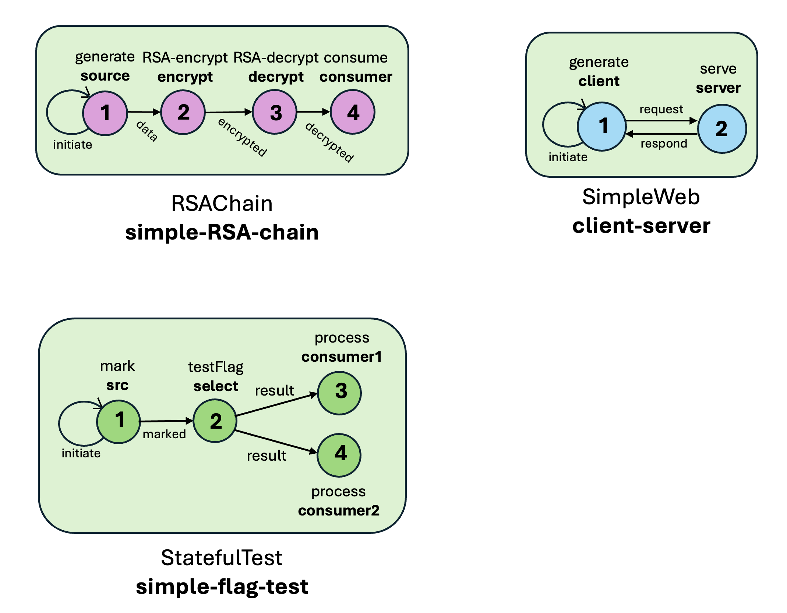
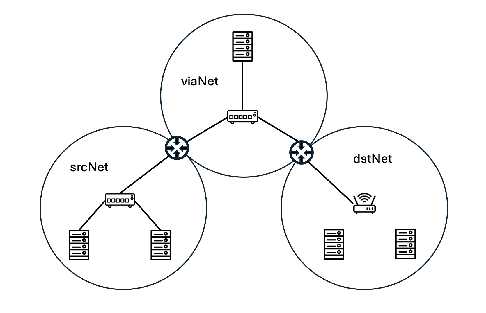
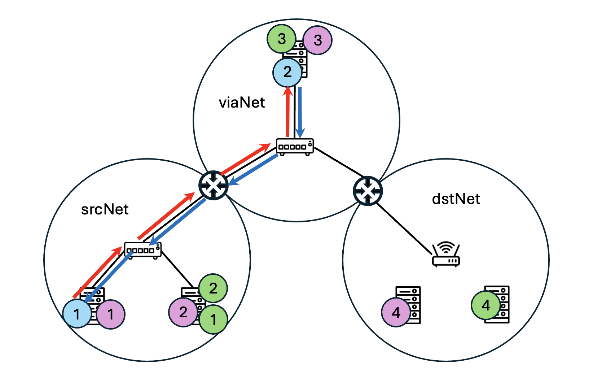

# MrNesbits (mrnsbits)
## Overview

All activity in a mrnsbit simulation is related to "Computation Patterns", or simply, CP.  One can think of a CP as a directed graph whose nodes represent computations, whose edges represent the transfer of data from one computation to another, and whose edges carry typed information describing the characteristics of the data that traverses the edge.  The computation model is that the arrival of a message to a node triggers some modeled activity at the node (which may require elapsed time), and may then trigger the sending of a message to another node.
Nodes are mapped to various hosts within a modeled network, and when the source and destination nodes are mapped to different host, the simulator simulates the transmission of that message through a modeled communication network.

The action of creating a MrNesbits model is one of defining CPs, defining a network, describing the mapping of CP nodes to hosts, and
providing parameters to model objects, parameters whose values will may impact the operational and performance behavior of the simulation experiments.
Much of this document is devoted to describing those actions in text files that mrnsbits reads at start-up.

## Running Example
Our explanations may be more accessible if read within the context of a running example.
The figure below shows the structure of three computational patterns. 



A CP's graph is enclosed in a rounded light green rectangle, with an external label comprised of two words.   The upper word denotes the CP's `type'.   The distinction being made here is that a model may contain a number of CPs that are structurally identical.   We will describe the type as sort of a structure in C or Go, and different individual instances of the CP.  The lower word, bolded, is the 'name' of some instantiation of the CP type.  In the example we do not have more than one instantiation per CP type, but the mrnsbits API permits it.
Circles within a CP's description identify individual functions.  Here, each has a stack of two words above or below it.  The top word is the type of the function, the lower word its 'label'.  As with CPs, our API supports defining the structure of a function type, and within the same CP have that type used multiple times. We do see that kind of replication in the example, the function type 'generate' and the function type 'consume' both appear in the graph for 'simple-random-branch'.   Edges between nodes are labeled with the 'type' of message that passes from source to destination.   (Nodes are labeled with integers solely for the purpose of description when we later talk about assignment of nodes to hosts in a network.)
We see that message types need not be unique within a CP, or across CPs.  In the API where uniqueness is required, a message type is inevidentably paired with the label of a function node serving as the edge's source, or destination.
All three CPs in the example have simple operation.  For each there is one or more nodes that have an edge from a node to itself labeled with the message type 'initiate'. This signifies that periodically the node will spontaneously generate a message, and treat it just as though it were a message arriving from a different node.  In general, when a node with label A receives a message with type 'msgtype' from a node with label B it does two things.  First, it delays its response by an epoch that is dependent on the type of the function, and characteristics of the message (e.g. the message type as well as values that the message may be carrying). After this delay it may generate its own message (which may have a different type and which may have different characteristics of the triggering message), and send it to another node.  We will later treat the selection of that node in greater detail, at this point it suffices to say that potential recipient nodes of a response message from node A must be the endpoints of edges that originate in node A, but that in the case of multiple outbound messages from node A, it need not be the case that there be a response at all, or that all of the nodes represented in the graph receive one.  The edges identify necessary but insufficient conditions for receiving a response message.
The semantics for two of the CPs in the example are pretty self-evident. For the AESChain and SimpleWeb types the originating node periodically sends a message to another, making no choices about the selection.  The recipient likewise has only one choice of output edge it can propagate another message across.  The RandomBranch CP has more complexity.
The select function has two input edges and two output edges.   It is not codified in this figure how that function responds to input, indeed, its response depends on the simulator's interpretation of initialization parameters.   It happens that in this example those parameters specify that an input message is routed to one of the two consumer functions, with the choice being made using a probability distribution, and the values of the probability distribution are themselves a depend on the source of the initiating message.  A message from src1 might be routed to consumer1 with probability 0.25 and to consumer2 with probability 0.75, while a message from src2 might be routed to consumer1 with probability 0.1, to consumer2 with probability 0.6, and dropped altogether without being routed with probability 0.3.

CP execution is simulated within the context of a modeled communication network.  The figure below illustrates an example.



The colored circles represent broadcast domains, or subnets within which a host can broadcast to all other hosts.  Broadcast domains are sometimes built so that all hosts are connected to the same switch through cables, or to a network of switches that are themselves connected through cables.   Other times a broadcast domain is defined by the hosts that can wirelessly connect to a wireless router, which itself is connected by cable to some wired network infrastructure.  This figure illustrates three broadcast domains, named srcNet, transNet, and dstNet.  The first two are wired and the figure illustrates that srcNet has two hosts, both connected to a switch, and that the switch is connected to a router at the boundary of srcNet and transNet.   dstNet is a wireless domain and its two hosts communicate with a wireless router that has a wired connection to a router at border of dstNet and transNet.  The switch in transNet connects to its host and to the two wired routers that connect transNet, and these two routers are themselves wired together.  Each of these routers connects to switching/routing devices in two broadcast domains, but the model allows for a broadcast domain to be contained within a larger network.
Consequently, both of these routers have interfaces to both of their networks that do not specify connections outside of the broadcast domains.   We will eventually use these interfaces to introduct background traffic into the simulation experiment.

Part of an experiment's configuration assigns a CP's functions to hosts. A CP's functions may be distributed among
different hosts, which means that a message generated by a function for another function on a different host must traverse the network.  The latency of that communication will depend on the path it takes and delay's through switches and routers on that path.   These delays can in principle depend on the total communication load on a device, which means that in general we should simulate the passage of a message through each device on its path, and for each device compute the latency through the device as a function of measurements or latency models.   The figure below illustrates the same communication network as before which now includes an assignment of CP functions to the hosts, and a communication path for the client-server.

 

The simulation model accounts for delays through every interface and device on the path to a message's latency.   The value of these delays depend in general on configuration parameters such as bandwidth of various interfaces, nominal latenies through wired connections, bandwidth and latency of wireless broadcast domains, etc.

## Configuration files
The mrnsbits framework is quite general, with the consequence that a user much expend considerable effort in developing and validating configuration information needed for an experiment.  Our approach has been to build an API for a library of Golang structures and functions that build them to automate in part some of the configuration decisions (especially the generation of the many many name identifiers used within a model).   This means that in principle one runs a program to generate the configuration parameters for a simulation experiment.  We have taken the approach of writing the configuration information out in files formated in the JSON or in the YAML data specification languages. Preferring YAML, this documentation describes configuration using YAML.

### Schema
We make a nascent (but incomplete) attempt to make the required format of each configuration file rigorous. A natural approach would be to consider standard YAML schema (such as [Rx](https://rx.codesimply.com) or [Failsafe](https://yaml.org/spec/1.2.2/)).  We find these to be insufficient for our purposes, principally because they appear to lack ways of specifying data-file-dependent constraints on the keys and values expressed in the schema.

We are using then a schema that draws much inspiration and syntax from YAML, but includes notation that specifies the kinds of constraints we want to express.   In principle a validator could be written that checks a data file against one of our schema, but we relegate that activity to "future work".

The Failsafe schema requires specification of all keys;  any key in any data file that might be validated in general has to appear in the schema if its appearance is to cause validation against the constraints the schema specifies for that key.  So, for example, a data file with a record type which has the key 'name'
```
   	name: "RSA Alice"
```
may have that entry validated against its value being a string by a statement in the schema
```
    name: !!str
```
It can be possible to limit the key to something expressed by a regular expression, but here one is left with an ability to have the key match anything, or be limited by some regular expression that is known before the data file is presented for validation.

It also appears to be the case that while some values for name might be known ahead of time and be checked against a list, e.g.,
```
    name :
       Tiberus: !!str
       Caligula: !!str
       Diocletian: !!str
```    
If we want to express constraints on the value, when the constraint depends on the data file, we cannot.

We address this by exploiting the support YAML has for inline comments.  A YAML parser will ignore all the characters following the pound sign in a line, which means that if we have a line whose first bunch of characters is white space and then there is an pound sign, the whole line is considered by YAML to be empty and is ignored. We use this to introduce annotation within a comment.

It is often the case that the key for a YAML map is the value from some other table, e.g., the name of a CP.  We want a map that says 'for this CP the list of functions are this, and the list of edges that define relationships between funcs is that'.  Consider the snippet of YAML below
```
     ### apicpn in apicpname ###
     name: apicpn
    
     ### apicpt in apicptypes ###
     cptype: apicpt
     funcs:
       ### apift in apifunctypes(apicpn) ###
       - functype: apift
       
       ### apiflabel in apifunclabels(apicpn) ###
       - label: apiflabel
```       
If all the keys and values that begin with 'api' were strings, this would be a perfectly valid piece of YAML. For us, the problem in validating this is that (unlike the strings that do not begin with 'api') they come from the data.   The annotation above identifies a number of lists of strings

	- apicpname is the list of names of computation patterns in the data file
	- apicptypes is the list of all 'types' of computation patterns in the data file
	- apifunctypes(apicpn) is the list of types of all functions in the computation pattern whose type is encoded within the string variable apicpn

The notation above constrains string variable apicpn to come from the list apicpn.  Again, the contents of such a list would vary with each data-file, and the idea of the data descriptor like that above is that it describe relationships among elements of all data-files with a certain format that the schema defines.   Observe that the variable apicpn appears more than once, as a key and also as part of the definition of other lists.   We are not yet parsing expressions like these, but if we were we'd have to expression some scoping rules.  The hierarchical nature of YAML makes it easy to define one---a string variable has scope with the YAML level of the statement following its introduction.  This means that in the expression above apicpn has the same value as part of the statement of lists apifunctypes(apicpn) and apifuncnames(apicpn) as it does as a key.  We forbade redefinition of a string variable within the scope of its definition.

Finally, to make the example above concrete, we imagine a data file that declares computational patterns with names Alice and Bob, both of computational pattern type Rivest.   CPs of type Rivest has functions 'communicate', 'signal', 'move'.  The instantiation of Alice gives label 'whisper' to 'communicate', 'wave' to 'signal', and 'waltz' to 'move'.  The instantiation of Bob gives label 'burp' to 'communicate', 'scratch' to 'signal', and 'stumble' to 'move'. These assignments define
```
	- apicpname = [Alice, Bob]
	- apictypes = [Rivest]
	- apifunctypes(Alice) = [communicate, signal, move]
	- apifunclabels(Alice) = [whisper, wave, waltz]
	- apifunctypes(Bob) = [communicate, signal, move]
	- apifunclabels(Bob) = [burp, scratch, stumble]
```	
The snippet below is legal YAML from the data file that validates against this schema
```
    name: Alice
	cptype: Rivest
	funcs:
	  - functype: communicate
	    label: whisper
	  - functype: signal
	    label: wave
	  - functype: move
	    label: waltz
	 
    name: Bob
	cptype: Rivest
	funcs:
	  - functype: communicate
	    label: burp
	  - functype: signal
	    label: scratch
	  - functype: move
	    label: stumble
```
Notice that the schema also validates data-files that don't follow constraints not expressed by this schema.
For example, it may be that in the model it makes no sense to have label 'waltz' associated with type 'communicate'.   We could of course define a list of labels that are acceptable for a given func type and introduce that here, but we believe that ultimately a schema like this won't capture all of the constraints a modeler may have between data elements, and so that there must be some program written that analyzes a data set for compliance with them all.   The real value of the schema we present here is to give some structure and a framework to explain the meaning of the different data elements that are introduced to configuration files.
         

### Configuration Files

The information mrnsbits uses to configure for a simulation experiment is organized in six files
- **cp.yaml**: Describes the computation patterns (CP) used in the experiment.
- **cpInit.yaml**: The functions in all the experiment's CPs must be initialized, to include thresholds that govern their behavior, and how each responds to input.  Each function execution type has a defined structure that holds such information for its type; this file contains these descriptions.
- **topo.yaml**: Communication between functions of a CP that reside on different hosts use a communication network to convey their inter-func messages.  The network has different devices (e.g., hosts, switches, routers) that are connected different ways. This file describes that structure, and may contain specification of network specific parameters such as bandwidth through a network interface.
- **map.yaml**: cp.yaml describes instantiations of computation pattern functions. (func), and topo.yaml describes network topology, in particular, the identities and placement within the network of hosts.   Each instationation of a CP has its funcs distributed among hosts, and when a message is directed from a func on one host to be received by a func on another host, the network behavior is simulated.  map.yaml for each of an instantiated CP's funcs, map.yaml specifies the name of the host where that func executes.
- **exp.yaml**: The behavior of the simulated activity depends on various parameters that describe performance. One instance would be the type of CPU a given host has, another would be the latency of a bit across a given specified connection between two devices that have a direct wired connection, yet another would be the maximum bandwidth of a specified network interface. exp.yaml provides such parameters, in a form that makes it easy to include new types of parameters.
- **exec.yaml** The execution time of a CP function or packet-transfer operation of a device depends on the type of hardware performing the execution, and on characteristics (such as packet length) of the data being operated on.  exec.yaml specifies types of CP functions, and their execution times on different hardware platforms with different lengths of packets being operated on.


Consider these individually.
#### cp.yaml 

The cp.yaml specification below assumes that string variable 'apicpn' has a value that matches the name of a CP.
Things to note include
- presumption of definition of value lists 
	- apicpnames: list of all CP names
	- apicptypes: list of all CP types
	- apifunctypes(apicpn): list of types of all funcs defined for CP with name apicpn
	- apifunclabels(apicpn): list of labels of all funcs defined for CP with name apicpn
	- apimsgtypes(apicpn): list of types of all messages defined for CP with name apicpn
- the string defined by 'dictname' is an identifier for the defintions within cp.yaml, it is not used by mrnsbits
- each CP is represented by a map that is indexed by the CP 'name' value
- The description of a CP is given in terms of a list of functions, and a list of edges between the functions
- A function is described by a 'label'---a unique identifier for the function within the scope of the CP definition, and an execution type.  The execution type at present is one of 'static', 'deterministic', and 'random'.   Static functions are characterized by having the response message to an an input message be statically determined by the identity of the source function and the type of the message that is carried.   The output of a deterministic function can be a function of the identity of the source, the type and content of the initiating message, and some state saved in association with the instance of the function.   However, that determination is a deterministic function. By contrast a 'random' function's response is chosen randomly from among a set of identified outputs, with those outputs and the probability distribution itself being dependent on the source of the initiating message and the type of that message.
- An edge in the CP graph is characterized by the functions serving as source and destination, the type of message that crosses the edge, and a user-defined floating point value.   The same two functions can serve as source and destination edges for multiple edges, so long as those edges carry messages of different types.

```
# dictname is a label for the comp pattern dictionary, not used explicitly by MrNesbits
# patterns is a map with keys that are types of computation patterns, from list apicptypes
dictname: !!str
patterns: 
    ### apicpn in apicpnames ###    
    apicpn: 
    #+ edges is an array, each of whose elements is a map whose attributes describe an edge in the comp pattern func graph

    #+ cptype is unique identifier of a class of computation patterns, from which instances are derived and instantiated
    ### apicpt in apicptypes ###
    cptype: apicpt

      #+ name is unique identifier of an instance of a computation pattern 
      name: !!str

      #+ funcs is an array of maps, each of whose elements is a map that gives attributes of an instance of computation function
      funcs: 
        #+ functype is the type of the function, value from apifunctypes associated with comp pattern apicpn
        ### apift in apifunctypes(apicpn) ###
        - functype: apift
          #+ label is the instance-specific identifier for an instance of a comp pattern function 
          ### apiflabel in apifunclabels(apicpn) ###
          label: apiflabel
     
          #+ exectyp is code for the execution type of the func (e.g., static, deterministic, random)
          exectype: enum[static, deterministic, random]

      #+ edges is an array of maps, each of which describes an edge in terms of its endpoints (func labels) and data carried between them 
      edges: 
          #+ srclabel is the label of a function from which this edge originates
          ### apisrclab in apifunclabels(apicpn) ###
        - srclabel: apisrclab

          #+ dstlabel is the label of a function at which this edge terminates
          ### apidstl in apifunclabels(apicpn) ###
          dstlabel: apidstl

          #+ msgtype is the type of the message that is carried across the edge
          ### apimsgt in apimsgtypes(apicpn)
          msgtype: apimsgt

          #+ weight is a parameter associated with the edge, interpreted differently depending on function execution type.
          weight: !!float
```

A concrete example of cp.yaml that describes the computation patterns illustrated earlier is [at this link](yaml/cp.yaml.txt).


#### cpInit.yaml

The behavior of functions in computational patterns can depend on various parameters that are specified for them when the simulation experiment is started. Principle among these are parameters that define what the function does in response to incoming messages.  The cpInit.yaml document is a map whose keys are the names of the computation patterns used in the experiment.  The parameters for a CP is itself a map whose keys are the labels of functions in the CP.  Each of the func's keys has a map whose structure depends on the func's execution type ('static', 'deterministic', or 'random').  Independent of execution type, every func map gives the type of the CP (with key 'name') and the label of the func.  Each has also a list of messages used by the CP:
```
  msgs:
      #+ msgtype identifies the type of message received or sent in a response
      ### apimsgtype in apimsgtypes ###
    - msgtype: apimsgtype
    
      #- pcktlen carries a length parameter that can affect a func's execution time
      pcktlen: !!int
      
      #- msglen carries a length parameter that can affect func's execution time
      msglen: !!int
```

The definition of a parameter map for the response of a static function is given below.  It assumes a binding of string value to variable 'apicptype', the type of the CP whose func response is being described.

```
  staticparams:
	#+ type of CP in which this func instance is embedded
    pattern: apicptype

    #+ label of the func label whose responses are described
    label: apifunclabel

    #+ response is a list of response descriptions, whose definition depends on the func's execution type
    response:
      #+ inedge is a key indexing a map which describes edge in the comp pattern graph
      - inedge:
          #+ srcLabel is a key indexing the label attribute of a function in the comp pattern graph
          ### apisrclabel in apifunclabels(apicpn) ###
          srclabel: apisrclabel

          #+ msgtype is a key indexing a string giving the type of a message 
          ### apiinmsgtype in apimsgtypes(apicpn) ###
          msgtype: apinmsgtype

        #+ outedge is a key indexing a map which describes edge in the comp pattern graph
        outedge:
          #+ msgtype is a key indexing a string giving the type of a message 
          ### apioutmsgtype in apimsgtypes(apicpn) ###
          msgtype: apioutmsgtype

          #+ dstLabel is a key indexing the label attribute of a function in the comp pattern graph
          ### apidstlabel in apifunclabels(apicpn)
          dstlabel: apidstlabel

        #+ period, when non-zero, identifies how often self-initiation is triggered 
        period: !!number

```
The response simply identifies source and message type of the 'inedge' input that triggers the response, and the corresponding message type and destination func of the response. 'period' is meaningful when the inedge is a self-initiating one, as it gives the lenght of time (in seconds) until the next self-initiation.

The definition of a parameter map for a deterministic function is similar, but with two important differences.  The main body of the map includes a map of strings to strings, called state.  The idea is that we can convey as many parameters as we like to the func for reference in its execution, organized where each parameter has a string key and a string value.   The value can be transformed into other types as desired, what is important here is a general definition that accomodates this generality.  In addition each response definition has an additional parameter whose key is 'choice'.  This parameter is a string, and serves as an identifier for the simulation logic that chooses the output in response to the input message type, the input message contents, and the contents of the func's 'state' parameters.
```
 detparams:
    pattern: apicptype

    #+ label of function whose responses are given
    label: apilabel

    #+ state holds information that can be used to compute response
    state:  !!map

    #+ funcselect is a string that identifies which pre-compiled function will be used at evaluation
    funcselect: !!str

    #+ response is a list of responses for deterministic functions
    response:
      #+ inedge is a key indexing a map which describes edge in the comp pattern graph
      - inedge:

        #+ srcLabel is a key indexing the label attribute of a function in the comp pattern graph
        ### apisrclabel in apifunclabels(apicpn) ###
        srclabel: apisrclabel

        #+ msgtype is a key indexing a string giving the type of a message 
        ### apiinmsgtype in apimsgtypes(apicpn) ###
        msgtype: apinmsgtype

      #+ outedge is a key indexing a map which describes edge in the comp pattern graph
      outedge:

        #+ msgtype is a key indexing a string giving the type of a message 
        ### apioutmsgtype in apimsgtypes(apicpn) ###
        msgtype: apioutmsgtype

        #+ dstLabel is a key indexing the label attribute of a function in the comp pattern graph
        ### apidstlabel in apifunclabels(apicpn)
        dstlabel: apidstlabel

      #+ period, when non-zero, identifies how often self-initiation is triggered 
      period: !!number

      #+ choice encodes a parameter used to include this response in the output
      choice: !!str
```

Finally, the parameters for a random func response are somewhat different as they describe probability distributions.
The main body of the parameters are like those of the static and deterministic functions.  However, the structure of a response changes.  We use a map whose keys are output edges (e.g., the destination func and the type of message carried) and whose value is the probability that that output edge is chosen.   These probability distributions are associated with individual input edges, which enables one to choose an output edge using a different probability distribution for one input than it does for another.
```
  rndparams:
    #+ pattern is the type of the associated comp pattern 
    ### apicpt in apitypes ###
    pattern: apicpt

    #+ label is the label for this function in the instantiation of the CP type
    ### apilabel in apifunclabels(apicpn) ###
    label: apilabel

    #+ response is a list of responses for deterministic functions
    response:
      #+ inedge is a key indexing a map which describes edge in the comp pattern graph
      inedge:

        #+ srcLabel is a key indexing the label attribute of a function in the comp pattern graph
        ### apisrclabel in apifunclabels(apicpn) ###
        srclabel: apisrclabel

        #+ msgtype is a key indexing a string giving the type of a message 
        ### apiinmsgtype in apimsgtypes(apicpn) ###
        msgtype: apiinmsgtype

        #+ msgselect is a key that maps to a map whose keys are themselves maps (describing output edges)
        msgselect:
              #+ '? ' flags a complex mapping key, here an output edge (pairing of message type and label of destination func)
              ### apimsgtype in apimsgtypes(apicpn) ###
              ### apifunclabel in apifunclabels(apicpn) ###
          ?   msgtype: apimsgtype
              dstlabel: apifunclabel
              : !!float
```
The main syntactic point to be appreciated here is how the key of a map is described to be a map itself.  This is accomplished with a '?', followed by map values that serve as keys and a ':' to identify the probability given to that output edge.

To make this less abstract, the cpInit.yaml document associated with our example is available through [this link](yaml/cpInit.yaml.txt)

#### topo.yaml

The topo.yaml document identifies the networks and devices that define the experiment's network topology.  Their specification is straightforward, the schema below describes it.
```
# specification for topo.yaml, the network topology

#+ hosts is an array of maps, each of which describes a host
#+ switches is an array of maps, each of which describes a switch
#+ brdcstdmns is an array of maps, each of which describes a broadcast domain

#+ name is an identifier for this particular topological instance
name: !!str


#+ networks is an array of maps, each of which describes a network
networks: 
    
    #+ name gives the string used in the simulation to identify the network
    ### apinetname in apinetnames ###
  - name: apinetname

    #+ nettype gives a code that describes the scale of the network, e.g. LAN, WAN
    ### apinett in apinettypes ###
    nettype: apinett

    #+ mediatype identifies the sort of media the network has, e.g., wired
    ### apimedia in apimediatypes ###
    mediatype: apimedia

    #+ brdcstdmns is a list of names of broadcast domains encapsulated in the network
    brdcstdmns: 
      ### apibcd in apibcdnames ###
      - apibcd

    #+ routers is a list of names of routers that have interfaces facing this network
    routers: 
      ### apirtrn in apirtrnames ###
      - apirtrn
#+ routers is an array of router maps, each element describing the particulars of one router
routers:

    #+ name gives the string used in the simulation to identify the router
    ### apirtrn in apirouternames ###
  - name: apirtrn

    #+ model identifies the type of the router, used to select an ops execution time from the devops timing table
    ### apimn in apimodelnames ###
    model: apimn
        
    #+ brdcstdmn identifies the broadcast domain if the router is a wireless hub for the domain, empty otherwise
    ### apibrd in apibrdnames ###
    brdcstdmn: apibrd

    #+ interfaces is an array of representations of interfaces on the router
    interfaces: 
      - $ref: '#/definitions/interface'

hosts:
      #+ name gives the string used in the simulation to identify the host
      #+ brdcstdmn identifies the broadcast domain in which the host resides
      #+ model identifies the cpu of the host
      #+ interfaces is an array of representations of interfaces on the router

    ### apihostn in apihostnames ###
    - name: apirtrn

      ### apibrd in apibrdnames ###
      brdcstdmn: apibrd

      hosttype: !!str

      ### apimn in apimodelnames ###
      model: apimn
        
      interfaces: 
        - $ref: '#/definitions/interface'

switches:
      #+ name gives the string used in the simulation to identify the switch
      #+ brdcstdmn identifies the broadcast domain in which the switch resides
      #+ interfaces is an array of representations of interfaces on the router
      #+ model identifies the cpu of the host

      ### apiswn for apiswn in apiswitchnames ###
    - name: apiswn

      ### apibrd in apibrdnames ###
      brdcstdmn: apibrd

      ### apimn in apimodelnames ###
      model: apimn
      
      interfaces: 
        - $ref: '#/definitions/interface'
      
broadcastdomains:
     
  #+ name gives the string used in the simulation to identify the broadcast domain
  ### apibcdn in apibcdnames ### 
  - name: apibcdn

    #+ bcdtype gives the possibility of different types of BCD, kinda escapes me why at the moment
    bcdtype: BCD

    #+ network gives the identity of the network host the BCD
    ### apinetn in apinetnames ###
    network: apinetn

    #+ mediatype gives the type of communication media used in the BCD, either wired or wireless
    mediatype: enum[ wired, wireless]

    hosts:
        #+ hosts gives a list of names of hosts within the BCD
        ### apihstn in apihostnames ###
      - encrypt-host

    #+ hub is the name of the device serving as the BCD hub
    ### apihubn in apihubnames ###
    hub: apihubn


definitions:
  interface:

    #+ name is unique string name for interface
    ### apiifn in apiintrfcnames ###
    name: apiifn

    #+ devtype is one of host, router, switch identifying the type of the device hosting the interface
    devtype: enum[ Host, Router, Switch]

    #+ mediatype identifies the kind of media in the network the interface faces
    mediatype: enum[ wired, wireless]

    #+ device is the name of the device which hosts the interface
    ### apidevn in apidevnames ###
    device: apidevn

    #+ connects, if not empty, identifies the name of the interface connected directly to through a wire
    ### apiifn in apiintrfcnames ###
    connects: apiifn

    #+ faces is the name of the network the interface faces
    ### apinetn in apinetnames ###
    faces: apinetn
```

Most of the key-value pairs are intuitive and obvious, given our earlier descripton of the topology.  Points that are important but perhaps not obvious include
- every network, device, broadcast domain, and network interface has a unique string identifier.   MrNesbits makes no assumptions about the structure of these identifiers, even though it is convenient to use a standard formula when creating topo.yaml with a computer program.
- A broadcast domain holds hosts and a hub.   That hub may connect with a router.  Hubs of wireless broadcast domains are routers, whereas hubs of wired broadcast domains are switches.  Therefore a router serving as a hub will have a non-empty property 'brdcstdmn' holding the name of the broadcast domain in which it resides, a property that is otherwise empty.
- Interfaces hold the names of the devices in which they are embedded (through the 'device' property) and the type of that device (through the 'devtype' property).   If the network the interface faces is wired and there is a wired connection from the interface to another on a different device, the 'connects' property holds the name of the other interface;  'connects' is otherwise empty. An interface's 'faces' property is always non-empty and holds the name of the network to which the interface connects.
- The 'hosttype' property allows the simulator to differentiate between hosts in ways beyond just the CPU.  However, use of this property is optional.
- An interface on a host may connect only to the interface of the switch serving as hub of the host's broadcast domain. 

The topo.yaml file for the running example is found [here.](yaml/topo.yaml.txt)

#### exp.yaml

The structure of exp.yaml is very simple.   It has a list of execution timings for functions, and a list of execution timings for device operations involved in the movement of a packet through the device.   The timing descriptions are organized by func label, for each label there is a list of timings each of which differs from the others for that label in either the 'processortype' property or the 'pcktlen' property.

The schema for exp.yaml is below.
```
# configuration schem for exec.yaml, execution time parameters

#+ name is an identifier for this particular collection of times, not use explicitly by the simulator
name: !!str

#+ functimings is a map that organizes timings of particular functions
functimings:
  #+ name identifies a collection of timings used in a given experiment, a way of remembering the assumed values
  #+ times is a map whose keys are func labels, and whose values are maps that each describe a timing for that function
  name: !!str
  times:
    ### apifunctype in apifunctypes ###
    apifunctype:

        ### apicpu in apicpus ###
        #+ processortype identifies the hardware
      - processortype: apicpu

        #+ pcktlen identifies a 'packet' parameter for identifying the complexit of operation (in bytes)
        pcktlen: !!int

        #+ exectime identifies the elapsed execution time (in seconds) for doing apifunctype using the hardware of processortype and the pcklent
        exectime: !!float

#+ devtimings is a map that organizes timings of particular device functions
devtimings:

  #+ name identifies a collection of timings used in a given experiment, a way of remembering the assumed values
  name: !!str

  #+ times is a map whose keys are device operations, and whose values are maps that each describe a timing for that operation on particular hardware
  times:
    ### apidevop in apidevops ###
    apidevop:
        #+ model identifies the model name of the device whose timing is recorded
        ### apimn in apimodelnames ###
      - model: apimn

        #+ exectime gives the timing (in seconds), for the named operation on the named device
        exectime: !!float
```
The exec.yaml document for the running example is accessible [here.](yaml/exec.yaml.txt)

#### map.yaml

The schema for map.yaml is as simple as could be. It is comprised of a map whose keys are CP names, for each CP named there is a list of func labels, for each func label there is the name of the host where that func is mapped to be executed.  The schema is below.
```
# specification for map
dictname: !!str

#+ associates a comp pattern instantiation's name with a map which identifies the host wher each of its funcs is placed
map:
  ### apicpn in apicpnames ###
  apicpn:
    #+ patternname is the name of the instantiated pattern, same as apicpn
    patternname: apicpn

    #+ funcmap asociates the names (labels) of instantiated functions with names of hosts
    funcmap:
      ### apiflabel in apifunclabels ###
      ### apifhostname in apihostnames ###
      apiflabel: apihostname
```
The map.yaml document for the running example is accessible [here.](yaml/map.yaml.txt)

### exp.yaml

The exp.yaml file holds a list of maps describing the initialization of one or more model parameters.  Each parameter map has three properties. The 'name' is a string that may be anything that mrnsbits is written to recognize.   This can be the name of any device or interface, it can be a keyword that mrnsbits is written to recognize to apply to multiple parameters, it can be a keyword that defines a default value for simulation objects who need parameterization but have not otherwise been given it.

The schema for exp.yaml is below.
```
# specification for exp.yaml, experimental parameters

#+ name is an identifier for this set of parameters, possibly used in setting up a run but not used by the simulation itself
name: !!str

#+ parameters is an array, each element of which is a map that describes a parameter setting
parameters:
    #+ name identifies the component or class of components to which the parameter recorded here may apply
  - name: !!str

    #+ parametertype identifies the specific type of the parameter, at present set to be a member of a small set
    ### apiparamtype in apiparamtypes ###
    parametertype: apiparamtype

    #+ value identifies the value of the named parameter to be applied to the named component
    value: !!string
```
Here we notice that every value given as a parameter is a string.  This allows us to encode any string or numeric scalar, the decoding of which is done within mrnsbits.
The exp.yaml document for the running example is accessible [here.](yaml/exp.yaml.txt)  We extract below some of the parameter maps to highlight some of the points made earlier.

```
name: Topo-1
parameters:
    - name: DefaultIntrfc
      parametertype: WiredLatency
      value: "100e-6"
    - name: DefaultRouterIntrfc
      parametertype: WiredLatency
      value: "10e-6"
    - name: intrfc@Rtr:(srcNet-transitNet)[.11]
      parametertype: WiredLatency
      value: "2e-6"
    - name: intrfc@Rtr:(dstNet-transitNet)[.11]
      parametertype: WiredLatency
      value: "1e-6"
...
    - name: DefaultHost
      parametertype: CPU
      value: x86
    - name: encrypt-host
      parametertype: CPU
      value: x86
    - name: decrypt-host
      parametertype: CPU
      value: pentium
    - name: server-host
      parametertype: CPU
      value: M2

```


Many of the parameters expressed here are defaults, with the name identifying the parameter as a default and the model entities for which it is a default.  But we can refine selection of objects to and give them values that are different than the defaults.  In the above we have three separate values that speak to the latency of an interface's wired connection. If otherwise unspecified, a wired interface is given default latency of 100 microseconds.   However, interfaces that reside on Routers are configured to be much faster, with wireline latency of 10 microseconds.  But with a final refinement, the interfaces of the two routers that are connected together at transNet are configured to both have latency one microsecond.  Note that the seeminly curious naming convention of these two interfaces is a result of those names being generated automatically by a program that created these configuration files.

A final point to be absorbed is that exp.yaml is the vehicle used to assign CPU types to hosts. Explicit assignments are given for 'encrypt-host', 'decrypt-host', and 'server-host', but there is another host, 'reflect-host' that does not receive explicit assignment.   There is however a 'DefaultHost' declared, and so 'reflect-host' receives that assignment.


#folder