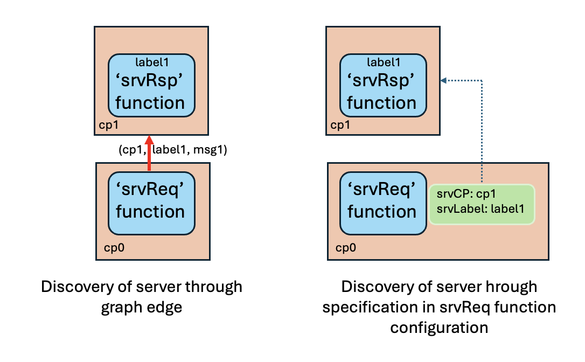

#### Overview of PCES Models

(last update March 26,2025)

The **pces** modeling abstraction is built to support the evaluation of the time it takes to complete a computation that is expressed as a chain of computations (called functions).  Each function receives input in the form of 'messages', and produces as output other messages.   There may be an associated simulation time duration associated with the processing of the message, and a defining feature of **pces** is that that time can be looked up in a table whose entries depend on the function, the length of the message, and the type of processor on which the computation is modeled to have been performed.   A compelling use case for **pces** is to define functions (e.g., the AES encryption of a 256 byte block using a 192 byte key and CBC cipher mode) and measure their execution times on testbed hardware, and use the timing measurements to populate the **pces** function execution time tables.

**pces** uses the notion of 'Computational Patterns', or CmpPtn, to organize expression of the functions.  Every instance of a function is associated with some particular named CmpPtn.  The global identity of a function is the pair comprised of its CmpPtn's name, and its own 'label'.   Different instances of a function with a given label are permitted so long as they are associated with different CmpPtn's.

A **pces** model identifies the functions, their interactions, their execution times, the architecture of the computer network on which they execute, and various parameters for the functions and the architecture that impact the behavior and the computed execution times of interest.  The **pces** API defines the inputs needed to express a model and run an experiment, and the **pces** distribution includes two ways to support the creation of those inputs.  One is a library written (like **pces**) in the Go language, and the other is a system for expressing the **pces** model using an Excel spreadsheet, with python scripts that transform the spreadsheet expression into the formats expected by the simulator (see [Building a PCES Model](#https://github.com/ITI/pcesbld/blob/main/docs/xlsxPCES-v1.pdf)).  Examples of models and their expression in xlsx are documented in [Running a PCES Simulation](#https://github.com/ITI/pcesapps/blob/main/docs/RunningPCES.pdf), and techniques a **pces** modeler may use to integrate their own functionality is documented in [User Extensions to PCES](#https://github.com/ITI/pcesapps/blob/main/docs/User-Extensions.pdf). 

**pces** relies on a separate-but-integrated discrete-event simulation of a computer network; part of the **pces** input configuration maps the application-oriented **pces** functions to particular computer hosts in that network.   The API for **pces** admits (with some work) integration of different network simulators, but we have developed one, the Multi-Resolution Network-Emulation Simulator (**mrnes**), and to date all the **pces** code we've pushed to github.com/iti has imported **mrnes** modules.   [Documentation](#https://github.com/ITI/mrnes/blob/main/docs/mrnes.pdf)  for **mrnes** is under the 'docs' directory on the **mrnes** github site.

Steps in creating and running a **pces** model are

1. Create the required inputs, and place them together in a subdirectory on your host computer, say, *input*.    The path to this directory is given to the simulator as its command-line input, *-inputDir*.
2. Ensure the existence of another directory on your host computer, say, *output*, to hold the output of a simulation run.
3. Run the simulator, ensuring that its various command line arguments are specified,  with *-outputDir* giving the path to the output directory specified above.
4. The simulator writes its outputs into directory *output*, and reports completion.

Importantly, note that step 1 of creating a model can be accomplished with the help of a tool [xlsxPCES](#https://github.com/ITI/pcesbld/blob/main/docs/xlsxPCES.pdf), where models are described using an xlsx spreadheet, and the necessary input files are created and placed automatically.   Examples of models and their expression in xlsx are documented in ()

There are of course many details to be fleshed out; the key take-away from this description is to call out that the input and output directories are user-specified, and that some command line action applied to the simulator program is required to launch the simulation.

#### pces Functions

The simulation of a function is triggered by the receipt of a message directed to that specific function.   A field of that message, *MsgType*, is of particular importance.  A function instance may have a number of code methods to use in responding to a message, and the value of *MsgType* is used to look up which of those methods is called in response.   

The nature of a function's response to a message depends on its **pces**-defined 'class'.   Note that the Go language does not offer a traditional programming language class, but what **pces** does is to differentiate between different functionalities at a relatively fine grained level of abstraction, and to define for each distinct class the format of a 'configuration' data structure and the format of a 'state' data structure.  The methods associated with a given class are written to access these class-specific data structures to use in their response to a message.

To illustrate the idea, consider Figure 1 below.  Each blue box is a function, the arrows indicate message flows.


*Figure 1: Chain of **pces** functions*


A certain amount of book-keeping is needed to track the computation that starts at one of the chain and ends at the other, and the logic for that is built into the *start* class of functions, an instance here being named 'srtThread'. The data structure read by this function includes specification of the message to be emitted, and the simulation time at which it should be emitted.    Likewise, in order to make measurements related to the chain of executions initiated by this message, a certain amount of book-keeping needs to be set up, and a function of the *measure* class---here 'srtMeasure'---does that.   No simulation time advance is associated with the execution of either function; indeed these functions are not describing activity that actually happens in the system, rather, they describe activity involved in performing the simulation.

With the measurement clock now ticking, the message is passed to a function here named 'generate packet', the purpose of which is to wait a period of simulation time to account for the amount of time spent creating a packet that will have a number of things happen to it downstream.  Functionally the message comes in, some period of simulation time elapses, and the message passes out.   The only variables in this are the source of the message (which is assumed to not matter), the destination of the departing message (to be derived from a topological description of the relationships between instances of functions),  and the length of the delay.   **pces** uses the 'MsgType' field of the incoming message to look up a code for the operation whose execution time is being modeled, and for which there will be an entry in the function execution time table.   This is the default behavior of functions of the *processPckt* class.

A message leaves the 'generate packet` function and is delivered to an 'encrypt' function, whose role is (merely) to introduce a delay in the forward progress of the messages based on the execution time needed to perform some computation.   It happens that this computation is encryption, but the response of this function is no different than the response of the 'generate packet' function to its message, the only difference being the length of time the message is delayed.  So the 'encrypt' function is of the *processPckt* class, as is the 'decrypt' and 'process packet' functions.  For all of these the 'MsgType' code and per-function-specific data structures are used come up with an operation code found in the function execution time table, and delay the message for a time uniquely uniquely identified by the function.

Function 'endMeasure' is also of the *measure* class.  A configuration flag tells the **pces** code handling an arrival there that a measurement is ending, and it branches to a different block of logic that completes the measurement bookeeping.   With no elapse of simulation time the message is passed, finally, to the 'endThread' function, which is of the 'finish' class.   That function does a last bit of bookkeeping cleaning up after the thread of execution just completed, and the chain of function calls triggered by 'srtThread' ends.  We call this chain of function calls an *execution thread*.

Another pair of **pces** class functions are worthy of notice.  Consider Figure 2, closely related to Figure 1.


*Figure 2: Chain of **pces** functions including server*

The difference here is that the 'encrypt' function is replaced by 'request encrypt', 'decrypt' is replaced by 'request decrypt', and both of these have some kind of connection to a function called 'crypto server'.   What **pces** is aiming to capture here is a common kind of relationship where a client asks a server for some data, or computation, the server performs what it is asked to do and returns a result to the client.  It happens that here we're modeling that the server is performing some cryptographic operation, but what is important here is the request-response-continue pattern of behavior, with some simulation delay associated with the server fulfilling its request.

The 'request encrypt' and 'request decrypt' functions are from the **pces** 'srvReq' class, and the 'crypto server' function is from the 'srvRsp' class.   As with the other classes, a class-specific data structure associated with a function governs its behavior, e.g., what operation to request of the server.

There are two other **pces** classes, 'transfer', and 'open', that we'll later introduce as needed.

##### CmpPtnMsg

The **pces** functions send, modify, and receive pointers to structs from the type *CmpPtnMsg*.   For clarity and reference it is worthwhile discussing the fields of this type.

```
type CmpPtnMsg struct {
    ExecID    int    // initialize when with an initating comp pattern message. Carried forward.
    FlowID    int    // identity of flow when message involves flows
    MsrID     int    // when carrying a measure, the identity of that measure
    PrevCPID  int    // ID of the previous comp pattern 
    PrevLabel string // label of the previous function

    XCPID  int      // cross-CP id
    XLabel string   // cross-CP label
    XMsgType string // cross-CP message type
    CPID   int      // identity of the destination comp pattern
    Label  string   // label of the destination function

    MsgType string  // describes function of message
    MsgLen  int     // number of bytes
    PcktLen    int  // parameter impacting execution time
    
    MsrSrtID   int      // ID of measurement function ID that started measurememnt
    StartMsr   float64  // time when measurement started

    RtnCPID    int    // used on service calls
    RtnLabel   string // used on service calls
    RtnMsgType string

    Rate       float64 // when non-zero, a rate limiting attribute 
    FlowState  string  // "srt", "end", "chg"
    NetLatency float64
    NetBndwdth float64
    NetPrLoss  float64
    Payload    any // free for "something else" to carry along 
}
```

A unique *ExecID* value is established with the creation of a first message to pass through an execution thread.  Any message that passes through a function carries the same *ExecID* on the way out as it did on the way in.  This makes it a useful index for marking messages associated with the same execution thread across functions.  

**pces** and **mrnes** support a network object called a *Flow*, which is traffic whose description is given in terms of average bitrate rather than a particular packet.  A *CmpPtnMsg* can carry information about a *Flow*, in particular an edge where a bitrate change is propogated through the network.   Flows have identities, *FlowID* is a unique id given when a flow is created.   Both flows and messages get different levels of priority when competing for resources, the *ClassID* identifies the priority class.  The larger the class id, the greater the priority.

Figures 1 and 2 illustrate functions of the *measure* class, some starting a measure, another ending a measure. (It is possible also to just 'include' a measure without starting or stopping one.)   To correlate measurements on the same execution thread across different measurement points, when a measure is first started the identity of the measurement point is written into the message, and like the *ExecID* is preserved through function calls.

It is sometimes useful for a function to know the source of a message it is processing.  Therefore the *PrevCPID*  and *PrevLabel* fields identify the *CmpPtn* of the source function, and its label within that CmpPtn.

*XCPID* and *XLabel*  are fields available to user code to specify 'the next' *CmpPtn* and function Label to visit when the message encounters the next function of the *transfer* class.   Their presence was driven by a use case during development where we wished to bind the target of a message that crosses *CmpPtn*'s to a message at the point the message is first created.

*MsgType* is a critical field, driving the response of a function to receipt of a message.   The field will usually be overwritten as the message passes from function to function.

*MsgLen* carries the number of bytes in the *CmpPtn* frame, and *PcktLen* carries the number of bytes in the data frame, the latter being a parameter used when the execution time of a function processing the message is determined.

*MsgSrtID* is an ID for a measurement that was started earlier in the execution thread this message is part of.  *StartMsr* is the simulation time when that measurement started.

*RtnCPID*, *RtnLabel*, and *RtnMsgType* are fields set by a function of the *srvReq* class, that requests service from some server that is typically in a different CmpPtn.   After service is provided there, the message is returned to the CmpPtn and function indicated by the first two of these fields, with a *MsgType* field given by in message's *RtnMsgType* field.  

When the message is associated with a *Flow*, the *Rate* field gives the bitrate of the edge of the flow described in the message.  *FlowState* is a code that indicates whether the message describes the leading edge of a new *Flow*, the trailing edge of a flow that is disappearing, or a rate change to a flow that has already been established and it not now terminating (even if the *Rate* drops to 0.0).

*NetLatency*, *NetBndwdth*, and *NetPrLoss* carry information about the latency, minimal bandwidth, and estimated probability of packet loss observed as a message traverses its execution thread.

Finally, a *CmpPtnMsg* struct can carry a pointer along the execution thread to any structure at all, in the *Payloa*d field.   For example,  it may be that the source of a message to deliver through function calls and network traversals comes from an external emulator, or even, real external device.  That network frame can be attached to a *CmpPtnMsg* through *Payload* and carried all the way to the destination of the execution thread where it can be accessed, and passed along to another real device or emulator.  There may be other applications, e.g. the structure *Payload* points to describes an event from a different simulator that is using **pces/mrnes** to simulate a connection between endpoints in the external simulator.

##### pces Function Organization

The input/output relationships between functions can be expressed by thinking of the functions as nodes in a graph, and defining a directed edge from one function to another when a message leaving the source function *may* be presented as input to the destination function.  We emphasize *may* here rather than *will* because there is nothing in the **pcecs** semantics that requires the transfer when an edge is defined in the **pces** model expression of topology.  That said,  in the default message handling functions provided in the *github.com/iti/pces* repository, with one exception a function has at most one output edge.  We will (eventually) document how users can augment **pces** model expression by writing their own message-processing methods, and these may well generate multiple outputs from a single function execution.

 A particular **pces** input file (nominally called 'cp.yaml') defines the CmpPtn's, identifies the functions assigned to them with their 'labels', and identifies known input/output relationships between functions though the definition of 'edges'.    Each edge is labeled with the MsgType of the message that may pass from one function to the other.

Simple *CmpPtn*s can be a chain of functions, just as in Figure 1.    In Figure 2 we could have the crypto server reside in a *CmpPtn* different from the other functions, or the same.    There is a certain coherence in presentation if functions in multiple CmpPtns request service from it, it then has no particular binding to any one of them.

As suggested by the explanation that the crypto server may be in a different *CmpPtn* than the functions that request its service, communication between functions in different CmpPtns is possible.

##### pces Function Execution

The processing associated with executing a function in response to a message is largely the same for every function class.  An event handler for a common function (*pces/cpg.go:EnterFunc*()) is scheduled, by a scheduling call that includes a pointer to a specific function instance where the execution is to occur, and a message to be passed to the code identified to execute the function.   When *EnterFunc* executes it extracts the *MsgType* field from the message, and consults a dictionary (*msg2mc*) defined in the to-be-executed function's configuration information a 'method code'.   The method code in turn is used as a key to a dictionary (*RespMethods*) that is specific to the function's class, to identify a 'response subroutine' which is then called to handle the message arrival.  Parameters to that subroutine include a pointer to the specific function (and its data), the method code, and the message.  The subroutine called is tailored to the behavior of the function's class and its data.   The depending on the function, it construct a code to use in looking up the elapse of simulation time associated with the function, and (eventually) modify the message, choose a destination for it, and initiate a process that leads to the delivery of the message to the destination, which is tantamount to scheduling *pces/cpg.go:EnterFunc()* again, with a different set of arguments.

Figure 3 illustrates these relationships.


***Figure 3: Selection and operation of response function for a given function instance.***

Given that there will be users developing code for integration into **pces** models and that that integration sometimes involves scheduling calls to *EnterFunc()*, it is worthwhile to take a closer look at its code.

```
  1 func EnterFunc(evtMgr *evtm.EventManager, cpFunc any, cpMsg any) any {
  2     cpfi := cpFunc.(*CmpPtnFuncInst)
  3     
  4     var stdFunc bool
  5     methodCode := "default"
  6     var cpm *CmpPtnMsg
  7     var msgType string
  8         
  9     if cpMsg != nil { 
 10         cpm, stdFunc = cpMsg.(*CmpPtnMsg)
 11         if stdFunc {
 12             msgType = cpm.MsgType
 13         } else {
 14             msgType = *cpMsg.(*string)
 15         }   
 16         if len(msgType)>0 && len(cpfi.Msg2MC)>0 && len(cpfi.Msg2MC[msgType]) > 0 {    
 17             methodCode = cpfi.Msg2MC[msgType] 
 18         } else if len(msgType)>0 && len(cpfi.Msg2MC)>0 && len(cpfi.Msg2MC["*"])>0 {  
 19             methodCode = cpfi.Msg2MC["*"]
 20         } else {
 21             methodCode = "default"
 22         }   
 23     }   
 24     if cpm != nil {
 25         AddCPTrace(TraceMgr, cpfi.Trace, evtMgr.CurrentTime(), cpm.ExecID,
 26             cpfi.ID, FullFuncName(cpfi,"EnterFunc"), cpm)
 27     }       
 28     
 29     methods, present := cpfi.RespMethods[methodCode]
 30     if !present {
 31         classMethods, classpresent := ClassMethods[cpfi.Class][methodCode]
 32         if !classpresent {
 33             panic(fmt.Errorf("error class %s response method lookup code %s",
 34                 cpfi.Class, methodCode))
 35         }
 36         methods = &classMethods
 37         cpfi.RespMethods[methodCode] = methods
 38     }
 39     // if the function is one that adds time (srvRsp, processPckt) then log
 40     // it on an MsrRoute if the message is on one
 41     if (cpfi.Class == "srvRsp" || cpfi.Class == "processPckt") && cpm.MsrSrtID > 0 {
 42          MsrAppendID(cpm.ExecID, cpfi.ID)
 43      }
 44
 45     methods.Start(evtMgr, cpfi, methodCode, cpm)
 46     return nil
 47 }
```

***Figure 4: Code body of EnterFunc()***

In line 1 we see the input arguments.   Type 'any' in Go means, literally, any pointer, which means that to use a variable of that type one needs to know the type of the pointer it holds, and do a cast.  Line 2 therefore is understood to cast the 'context' argument to be a pointer to a data structure associated with a specific function.  Argument *cpMsg* is another 'any' variable, which by our convention is either empty (nil) or a pointer to a struct description a message passed between functions.

Lines 4 through 7 declare and initialize local variables.

One can schedule *EnterFunc()* to run and provide 'nil' (the empty pointer) for the message pointer, *cpMsg*.  The test for non-emptiness at line 9 leads to execution at line 24 and then immediately to execution at line 29.  Here we see then that if *EnterFunc()* is scheduled with a nil pointer for the message, it will take the default method code (established at line 5).   If instead *cpMsg* is not empty, the logic of lines 10-15 determine whether *cpMsg* is a pointer to a message struct, or a string.  In the former case it takes the *MsgType* field of the message to be the message type, and in the latter case it takes the value of the referenced string.  The non-string logic serves a corner base when the function being executed is the first in  the execution thread, and there is no prior message.

Lines 16-22 work out what the method code is when a message is presented, with the logic that if the message actually has a message type (it is supposed to) and the function has a message-type-to-method-code dictionary (*msg2mc*) that is non-empty and has an entry whose key is the message type, then the method code is the dictionary value for that key.  Alternatively, if the dictionary exists, does **not** have a entry for the message type key, but **does** have a wildcard key '*', then the method code is the dictionary value of the wildcard.   If neither of these conditions holds, the the method code is defined to be *default*.

If it happens that *cpMsg* carried a pointer to a message,  lines 25 and 26 register an entry in a trace file (if tracing is enabled, a test which is not viewable in this code).

Line 29 attempts to look up a struct that holds a pointer to the response function. The dictionary searched is one specific to the function. If the search is successful the pointer is written into variable `methods` and the variable *present* is set to true, otherwise *present* is false.   If the method code is not found in the function's own *RespMethods* dictionary a check is made against a dictionary *ClassMethods* kept as a backup for all function for a class.  If the method code isn't found as a key to this dictionary either a run-time abort is executed.  If on the other hand a match is found in *ClassMethods*, the entry found is copied into the function's own dictionary (lines 36-37).

Lines 41 and 42 save the identity of the entered function on a list compiled for a measurement being taken along a path; only functions that advance simulation are included.

Reaching line 45, the *Start* entry of the found struct is understood to be a function with a signature of

```
func(*evtm.EventMgr, *CmpPtnFuncInst, *CmpPtnMsg)
```

The functions called through line 45 are so-called 'Entry' functions for the different function classes.   Text description of their operation are given later when we speak to each class.

When the processing associated with a message is completed, the message is placed in a data structure for retrieval by control function *ExitFunc()* (*pces/cpg.go:ExitFunc*) and execution of *ExitFunc()* is scheduled at a time that reflects the end of the simulation time delay introduced by the function, if any.   These steps are performed by the function called at line 39, or (depending on the function and class) by event handling functions that it causes to be executed when the function simulation has completed.  The destination CmpPtn, function label, and message type for each response message will have been decided and embedded in the message.   

*ExitFunc* is given a pointer to the function that is completing and a pointer to the original message that triggered the evaluation.  It uses the latter in particular to acquire the *ExecID* of the message, as the messages created in response will all carry that same *ExecID* code, and pulls up that list.    It enters a loop where for each resulting message it determines if the destination function is mapped to a processor other than the current one, and if so sets up and executes a transfer of that message to a network simulation, here, **mrnes**.   Part of the transfer setup is to record the particulars of the destination function so that when the message arrives at the targeted processor, the message is handed back to **pces** logic, and it has the information needed to re-introduce the message into **pces** level processing by scheduling an execution of *EnterFunc()* at the destination function, with the carried message, to occur at the  simulation time the message reached the target processor.

##### pces Function Class 

Now consider each of the **pces** function classes, the data expected of a user to configure their use, and a description of what the default response function does when called.    It is worth noting the functional signature of all routines called to process an arriving message (called type *StartMethod* in the **pces** code base).   One argument is a pointer to a data structure that manages event scheduling, another is a pointer to the function to be executed, another is a string, and the final one a pointer to the message being processed.

By way of explanation, in presentation of the function configuration structures all of the names are lower case.  The API for the **pces** input files uniformly specify variable names as lower case.    Yet in the discussion we present about those variables in the data structures we will give those names but with some letters capitalized.   The reason for this is that the Go library we use to serialize dictionaries for file storage requires that we declare a lower case label for every dictionary key, and that lower case label is what is written into the file.   The mapping from lower case label to something else is likewise described, and implemented when the files are read.   Our approach has consistently been to make the lower case label simply by changing upper case letters in dictionary keys to lower case.  An example of this is given below for the definition of the *CompPattern* struct. 

```
// CompPattern is a directed graph that describes the data flow among functions that implement an end-to-end computation
type CompPattern struct {
    // a model may use a number of instances of CompPatterns that have the same CPType
    CPType string `json:"cptype" yaml:"cptype"`

    // per-instance name of the pattern template
    Name string `json:"name" yaml:"name"`

    // instances of functions indexed by unique-to-pattern label
    Funcs []Func `json:"funcs" yaml:"funcs"`

    Services map[string]funcDesc `json:"services" yaml:"services"`

    // description of edges in Pattern graph
    Edges []CmpPtnGraphEdge `json:"edges" yaml:"edges"`

    // description of external edges in Pattern graph
    ExtEdges []XCPEdge `json:"extedges" yaml:"extedges"`
}
```

A statement like

```
CPType string `json:"cptype" yaml:"cptype"`
```

conveys that when the struct is serialized to yaml or json, the label in the serialized version is 'cptype' even though the label in the struct is not all lower case.

We turn now to a description of the data in each function classes' configuration struct.  There are two configuration state variables that appear in every class.    User code can create 'group' labels and assign these to individual functions, writing the group names into the 'groups list.'  Group labels can be used to identify functions within user code, particularly at initialization, by addition group names to the 'groups' list.    The other common variable is 'trace', an integer-coded Boolean (0 or 1) indicating whether executions of this function should be written to the trace file.  The reason for the integer coding is to circumvent issues we found serializing structs containing variables of Boolean type.  Integer representation avoids this complication.

###### class start

A table describing parameters that a user specifies for a start function is given below.

| name      | Data type               | Explanation                                                  |
| --------- | ----------------------- | ------------------------------------------------------------ |
| pcktlen   | integer                 | For messages involved in crypto, the block size in bytes     |
| msglen    | integer                 | The number of bytes in the network frame that carries the message |
| msgtype   | string                  | A code defined by the user to indicate what should happen with the message at the next function |
| data      | string                  | A placeholder to allow as-yet-unspecified parameters to be included.  User provided code will need to interpret the string |
| starttime | float                   | The simulation time at which the message should be defined and passed to the function's output. |
| msg2mc    | dictionary (str -> str) | The 'start' function is scheduled by some outside simulation control code, which provides a pseudo message as input, mostly so that the start function can be treated likely all the other classes.   Like regular messages, the pseudo message has a MsgType field, which, like other functions, is used as a key to the msg2mc dictionary, producing a 'method code' used as a key in a dictionary for the  *start* class, which leads to a subroutine call that performs the start function actions. |
| groups    | list (str)              | A list of names of user-defined 'groups' this function is assigned to |
| trace     | int                     | When equal to 1 the executions of this function are included in the trace generated for the simulation run, otherwise not. |

A start function's default subroutine is called *startEnter()* (in file pces/class.go).  It creates a message (of type *CmpPtnMsg*), and sets its *PcktLen*, *MsgLen*, and *MsgType* fields to the values described above in its configuration structure.   It also sets an 'execution thread ID' in field *ExecID*, which is maintained as the message traverses its chain of functions. Some bookeeping is done, and the created message is placed in a a list that control function *ExitFunc()* will examine for forwarding.   It then schedules *ExitFunc()* to execute with zero simulation delay, passing to it a pointer to this start function, and the created list.

###### class measure

| name    | Data type               | Explanation                                                  |
| ------- | ----------------------- | ------------------------------------------------------------ |
| msrname | string                  | Measurements are given a name, measurement identitiers are include on a message so that when a message passes through a measure function, measurement action is taken only if the measurement identifier on the message matches the measurement identifier associated with msrname. |
| msrop   | string                  | The measurement operation to be applied.  "start" initiates a new measurement, "end" completes one, and anything else simply ?records the measurement. |
| msg2mc  | dictionary (str -> str) | msg2mc[ msg.MsgType ] gives a method code, which must be found as a key in the **pces** RespTable dictionary for the *measure* class that maps method codes to subroutines called to process the message arrival. |
| groups  | list (str)              | A list of names of user-defined 'groups' this function is assigned to |
| trace   | int                     | IWhen equal to 1 the executions of this function are included in the trace generated for the simulation run, otherwise not. |

A measure function's default subroutine is called *measureEnter()* (in file pces/class.go).  This routine examines the *msrop* code to see whether the function starts a measurement. If so it creates a data structure to track the measurement, gives it an integer tag, and copies that tag to a field in the incoming message.   The default function assumes that the function has exactly one output whose complete specification (CmpPtn, function label, message type) have been specified by the **pces** *CmpPtn* graph.  The message is so modified and is placed where *ExitFunc()* will deal with it.

###### class processPckt

| name       | Data type               | Explanation                                                  |
| ---------- | ----------------------- | ------------------------------------------------------------ |
| timingcode | dictionary (str -> str) | The message 'MsgType' field is used as a key to acquire an operation code used to index into the function execution time table and acquire the simulation delay associated with executing this function. |
| msg2mc     | dictionary (str -> str) | msg2mc[ msg.MsgType ] gives a method code, which must be found as a key in the **pces** RespTable dictionary for the *processPcket* class that maps method codes to subroutines called to process the message arrival. |
| msg2msg    | dictionary (str -> str) | msg2msg[ msg.MsgType] gives a message type to use on the output message, in the event that there is more than one output edge associated with the function and so some choice must be made.   The output edge chosen is the one whose messsage type matches msg2msg[ msg.MsgType]. |
| accelname  | string                  | The presence of a non-empty accelname string tells **pces** to use the timings of a function accelerator card (e.g., hash function) on the processor to which the function is mapped, rather than the normal processor model. |
| groups     | list (str)              | A list of names of user-defined 'groups' this function is assigned to |
| trace      | int                     | When equal to 1 the executions of this function are included in the trace generated for the simulation run, otherwise not. |


The default subroutine for a *processPckt* function is in pces/cgp.go, and is called *processPcktEnter*.   It first looks up the simulation time delay associated with this function, with this message.   If it happens that accelname is not empty, it modifies the lookup to get timings based on the named accelerator's performance.    The function next looks up the **mrnes** endpoint on which the function is executing, and calls the endpoint's **mrnes** scheduler to manage the advancement of simulation time, allowing for the inclusion of effects of competition for CPU resources by other concurrent processes.   At such time as the scheduler knows when the service demands have been met, it schedules the execution of another of the function's event handlers, *processPcktExit*.    Execution of *processPcktExit* marks the message with the destination CmpPtn, label, and message type based on the assumption of there being exactly one output, with the transfer particulars having been specified by the declaration of the relationships between **pces** functions.

###### class srvReq

| name     | Data type               | Explanation                                                  |
| -------- | ----------------------- | ------------------------------------------------------------ |
| bypass   | int                     | When 1 the message bypasses this function and continues directly to the next function in the chain.  Provides an easy way to determine the impact on performance of including the service this function requests from a server, or not. |
| srvcp    | string                  | The name of the computational pattern that contains the server which will be requested to provide the service. |
| srvlabel | string                  | The name of the specific function that will be called to provide the service |
| srvop    | string                  | A code for the service operation to be requested from called server |
| rspop    | string                  | A code for the operation that processes the server response, if any |
| msg2mc   | dictionary (str -> str) | msg2mc[ msg.MsgType ] gives a method code, which must be found as a key in the **pces** RespTable dictionary for the *processPcket* class that maps method codes to subroutines called to process the message arrival. |
| msg2msg  | dictionary (str -> str) | msg2mc[ msg.MsgType ] gives a method code, which must be found as a key in the **pces** RespTable dictionary for the *srvReq* class, that maps method codes to subroutines called to process the message arrival. |
| groups   | list (str)              | A list of names of user-defined 'groups' this function is assigned to |
| trace    | int                     | When equal to 1 the executions of this function are included in the trace generated for the simulation run, otherwise not. |

The default subroutine for *srvReq* functions is *pces/class.go/srvReqEnter*.   It's first task is to determine the global location of the server to be queried for service.   A first step is to determine whether that is specified by the expressed topology of the model's functions. If it happens that the topological (graph) description of the model's functions defines an edge from this function to some other function that is of class 'srvRsp',  **pces** takes the destination function to be the server function.  If the model function topology does not identify the server,  *processPcktEnter* uses a non-empty value of srvCP to identify the server's source CmpPtn.   These two scenarios are illustrated in Figure 3 below.



​	*Figure 3: Direct methods for specifying server function that responds to srvReq Function query*

There is another means of identifying the server function, that is driven by a use case where, in order to capture the dynamics of a 'zero trust'  network architecture, every message that crosses processor boundaries must have the authenticity of the server checked.   There are a variety of ways of implementing that in practice, one of which has the receiving entity issuing a challenge to the sender, e.g., sends a back a nonce that should be signed or encrypted and sent back to be checked.   We can capture that pattern  if the first function to be executed in response to a cross-processor message requests a service---authentication---from the sender.    Expecting that executing the authentication computation would be provided in general, whenever needed, we imagine that that function resides potentially in a different *CmpPtn* than the sending function, and need not be the sending function itself. **pces** allows a *CmpPtn* definition to include table of 'Services', indexed by service op code, that points to the global identity of the function providing that service for that *CmpPtn*.    We illustrate that below on the left in Figure 4.  Without a direct use case but to complete the functionality, on the right in Figure 4 we illustrate that if the requesting function's *srvLabel* configuration variable is empty but its *srvCP* variable is not, then the same indirection logic can be used to identify the server, the only difference with the previous case being that the identity of the *CmpPtn* holding the Services table is specified in the configuration.


​	      *Figure 4: Indirect methods for specifying server function that responds to srvReq Function query*


We have so far been deliberately circumspect in discussing the *srvOp* variable,   because there is a bit of delicacy involved.   Motivated by our known use case of determining performance sensitivity to different crypto algorithms and their parameters,  we wish to configure the function that *requests* the crypto service with those parameters rather than the function that *provides* the service..   In this approach the requesting service just 'asks' the server to perform some particular operation, with that command carrying all the various parameters that impact the operation's execution time on the server. 

The methodology **pces** adopts then is to have the *srvReq* function's configuration *srvOp* code follow a particular form.  If that string has somewhere at least one '-' character, the substring defined from the first character up to the first '-' is a 'prefix' and is assumed to specify some service the server provides, like 'encrypt', 'decrypt', 'sign', 'auth', or 'hash'.    Codes we've used in examples for crypto include 'encrypt-aes-256-CTR', 'decrypt-rc6-2048-CBC' which code the operation, crypto algorithm, key length, and cipher mode.  The prefixes for these two examples are 'encrypt', and 'decrypt'.    If the value of variable *srvOp* has a prefix, that prefix is the key used in a 'Service's dictionary lookup, otherwise the whole *srvOp* string is the key.   The existence of a prefix involves the execution of a 'srvRsp' function also, as we will shortly see. 

After the global identity of the server is acquired, *srvReqEnter* prepares the message it sends to it.  That message includes fields that identify the *CmpPtn* and label of the requesting function,  copy the calling function's srvOp' code to be the message type, and crafts and stores in the message a field 'RtnMsgType' that should be used by the server as the message type of the message it returns to report service completion.  *srvRspEnter* also includes an entry in the requesting function's 'Msg2MC' table which maps (as a key) the value crafted for the message 'RtnMsgType' field to the function *srvReqRtn*.   When reporting the service completion, the server will use this code as the return message's MsgType field, which *EnterFunc* will use to look up subroutine *srvRspRtn* to deal with the response.

###### class srvRsp

| name         | Data type               | Explanation                                                  |
| ------------ | ----------------------- | ------------------------------------------------------------ |
| timingcode   | dictionary (str -> str) | The message 'MsgType' field is used as a key to acquire an operation code used to index into the function execution time table and acquire the simulation delay associated with executing this function. |
| msg2mc       | dictionary (str -> str) | msg2mc[ msg.MsgType ] gives a method code, which must be found as a key in the **pces** RespTable dictionary for the *srvRsp* class, that maps method codes to subroutines called to process the message arrival. |
| directprefix | list of strings         | This list holds possible prefixes of service operations requested of the server. |
| groups       | list(str)               | A list of names of user-defined 'groups' this function is assigned to |
| trace        | Int                     | When equal to 1 the executions of this function are included in the trace generated for the simulation run, otherwise not. |

The default subroutine for srvRsp functions is *pces/class.go/srvRspEnter* .  It understands the message type of the input message to carry a code for the service operation to be performed.  *srvRspEnter* determines whether that code has a prefix, and if so, whether that prefix is found in the function's 'DirectPrefix' list.  If a prefix is identified and is found in this list, the service op code is assumed to be an operation with a timing value in the function execution times table, and is used directly in looking up the operation's execution time.   If instead the message's type does not have a prefix, or has a prefix that is not found in the function's directprefix table, *srvRspEnter* assumes that the service op code is a key found in the function's TimingCode dictionary, and uses the string to which the service op code is mapped as an op code that will be recognized in the function execution time table.

One way or the other the message type field of the message is transformed into an operation code used to index into the function execution time table, to retrieve the time delay associated with that operation on the processor to which the 'srvRsp' function is mapped.  *srvRspEnter* next modifies fields of the received message to send it back to the 'srvReq' function that sent it;   the identity of that function was recorded in the message when it was sent, as was a specially crafted value to use now as the message's MsgType field.  *srvRspEnter* places the modified message where *ExitFunc* will find it, and finally schedules *ExitFunc* to execute after the time associated with the service operation execution elapses.

###### class transfer

Default response method subroutines write into a 'CmpPtnMsg's 'MsgType' field a code that not only is used at the next function to identify what it will do, but also to route the message there.   There is an implicit function-to-function routing step in Figure 3, as the message is depicted as leaving the response subroutine.    Under the covers, the source function has a table of global addresses of functions to which it may direct the message.   The 'MsgType' field is used to select the table entry, which holds the identity of the target's own CmpPtn and function label.   Note then that a message can cross between CmpPtn's in the course of its execution thread.

A **pces** user can develop models where the target function may be selected by a function earlier in the execution thread, and for convenience **pces** provides another construction for transfering a message from one CmpPtn to another.  This is the role of the 'transfer' function.

A 'transfer' functions configuration variables are listed below.

| Name     | Data Type | Explanation                                                  |
| -------- | --------- | ------------------------------------------------------------ |
| carried  | int       | Integer-encoded Boolean indicating whether target identifies are carried by the message |
| xcp      | str       | Name of the target CmpPtn, if not carried in the message     |
| xlabel   | str       | Label of the target function, if not carried in the message  |
| xmsgtype | str       | MsgType of the transferred message, if not carried in the message |
| msg2mc   | str       | msg2mc[ msg.MsgType ] gives a method code, which must be found as a key in the **pces** RespTable dictionary for the *srvRsp* class, that maps method codes to subroutines called to process the message arrival. |
| groups   | list(str) | A list of names of user-defined 'groups' this function is assigned to |
| trace    | int       | When equal to 1 the executions of this function are included in the trace generated for the simulation run, otherwise not. |

A 'transfer' function receives a message, looks up the global coordinates and message type of the message it pushes out, and hands the modified message off to **pces** to be routed like the output message of any other function.   The target's global coordinates are either extracted from the function's configuration variables, or, if the 'carried' flag in the configuration is true, from the incoming message itself.
